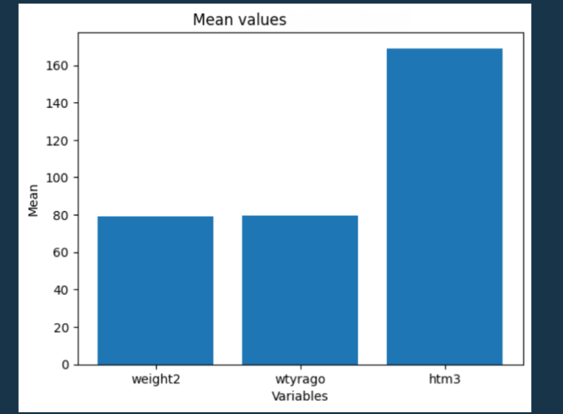
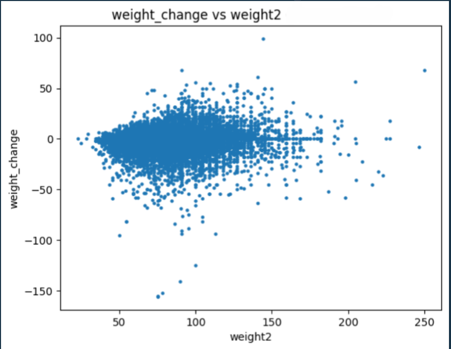
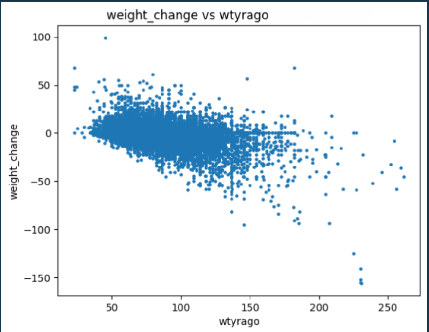
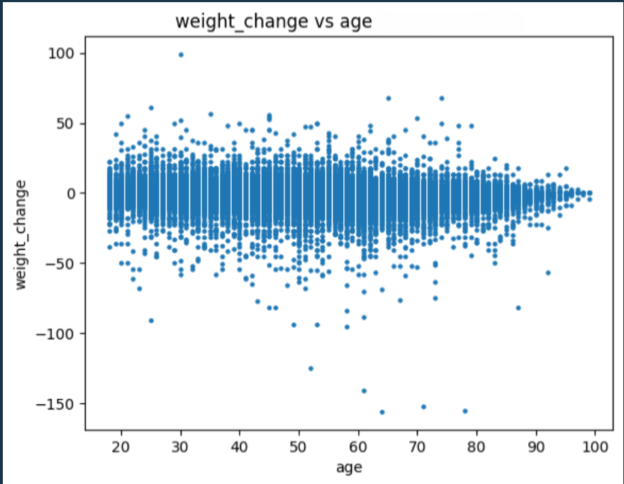
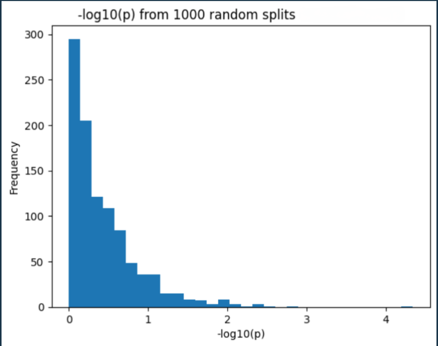

# Health Data Statistical Analysis using Python

## Overview

This project demonstrates statistical data analysis using Python. It includes data cleaning, exploratory data analysis, hypothesis testing, and data visualisation using a health dataset.

The analysis was completed using Jupyter Notebook as part of a university data analysis project.

---

## Objectives

- Perform statistical analysis on health data
- Explore relationships between variables
- Generate meaningful visualisations
- Apply hypothesis testing techniques
- Interpret analytical results

---

## Technologies Used

- Python
- Jupyter Notebook
- Pandas
- NumPy
- Matplotlib

---

## Project Files

- health-data-analysis.ipynb – Complete Python notebook
- ProjectReport.pdf – Final project report
- mean-values.png
- weight-change-vs-current-weight.png
- weight-change-vs-previous-weight.png
- weight-change-vs-age.png
- p-value-distribution.png

---

## Visualisations

### Mean Values

---

### Weight Change vs Current Weight

---

### Weight Change vs Previous Weight

---

### Weight Change vs Age

---

### P-value Distribution

---

## Statistical Methods

- Descriptive Statistics
- Data Visualisation
- Scatter Plot Analysis
- Mean Comparison
- Hypothesis Testing
- P-value Analysis

---

## Author

**Zihad Ahmed Sarker**

Bachelor of Information Technology

Australian Catholic University
